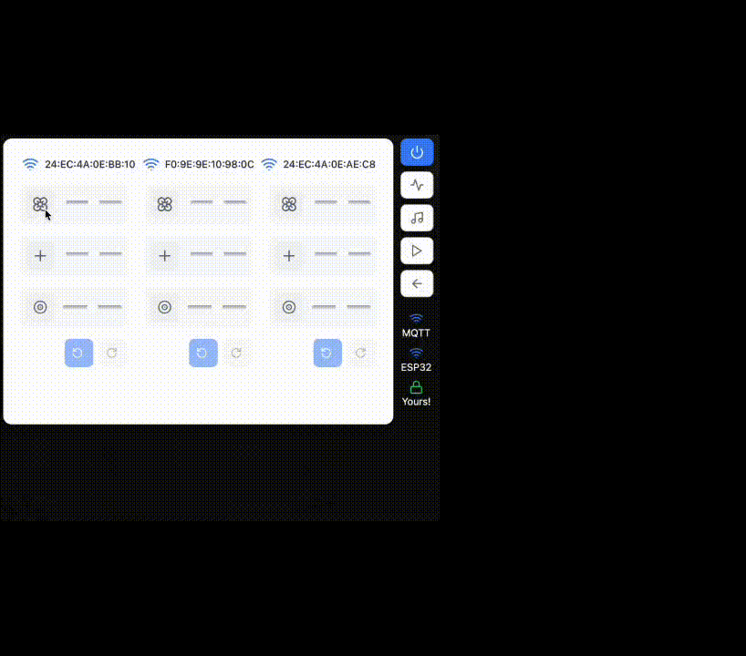
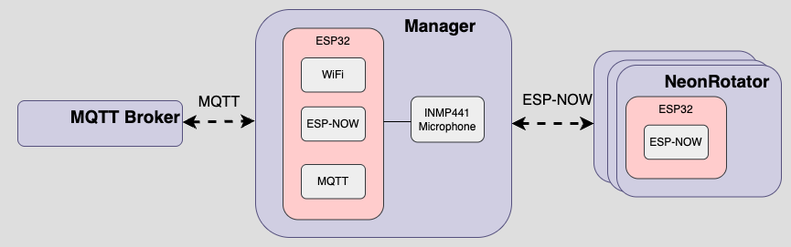
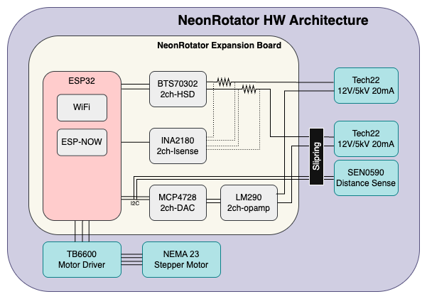
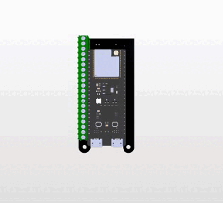
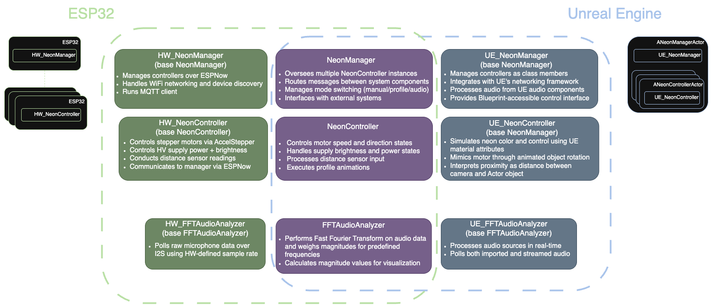

# overview
## introduction
WallFlower consists of 3 indistinct flowers, each of which comprising of 2 pieces of neon (still in progress) and 1 NeonRotator. This piece's main attractions are the rotational and interactive capabilities of each flower. Neon is typically a static medium - motion is often illusioned through the use of sequencing power on adjacent pieces, but rarely is it seen physically moving. NeonRotator allows this to be realized.

## motivation
Neon signage is omnipresent in the Bay Area. Walk around the streets of San Francisco and you'll see the windows and tops of businesses illuminated with deep reds, soft blues, and vibrant greens. 

I was first introduced to neon art as a medium in 2019 while taking a class at the Crucible in Oakland, CA. Learning about its rich history and required technical skillset inspired me to return to the Crucible many times in the years that followed in an attempt to better learn the craft. While still a novice, I find the medium fascinating and feel an obligation to help keep it alive as its popularlity declines year by year. Wallflower is my attempt at creating a piece that not only stands large in size, but adds a unique flare - kinetic motion.

## design
### NeonRotator
The NeonRotator is essentially a repackaging of a few off-the-shelf parts. The main components are:
- [ESP32S3 DevKitC-1](https://docs.espressif.com/projects/esp-dev-kits/en/latest/esp32s3/esp32-s3-devkitc-1/index.html) + custom expansion board
- [Tech22 12VDC/5kVAC Power Supply (x2)](https://www.t2-neonpower.com/PRODUCTS/NEON_SUPPLIES/midget_files/midget.html)
- [TB6600 Stepper Motor Driver](https://www.dfrobot.com/product-1547.html?srsltid=AfmBOoobZewFJ1Hjp4epvA72npQetNGYCTdOas3nNuor6x_4_qZnU2XR)
- [StepperOnline 23HS26-2004H Hollow Shaft Stepper Motor](https://www.omc-stepperonline.com/dual-shaft-nema-23-hollow-shaft-stepper-motor-bipolar-1-45-nm-205-38oz-in-2-0a-57x57x65mm-23hs26-2004h)
- [DFRobot SEN0590 Distance Sensor](https://www.dfrobot.com/product-2727.html)

The design goals were as follows:
1. **Illuminate two pieces of neon - one rotational, one stationary**: The intent is to emphasize the movement of the neon in the foreground by contrasting it with the stationary neon in the background.
2. **Make it interactive**: Passively rotating the piece wasn't going to be enough. The NeonRotator should be internet connected, and respond to audio + physical cues.
3. **Allow for an aspect of portability**: The unit mounts to a surface using 2 aluminum French cleats that double as a 12V and GND connection. This enables easy reconfiguration of different NeonRotators within a space.
4. **Make it as compact as it's subcomponents allowed**: The overall size of the NeonRotator is ultimately driven by the selected motor and motor driver - both of which are oversized for the power and torque requirements of the piece. The motor was selected solely for it's 8mm ID hollow shaft - this was the next diameter offered by StepperOnline above 4mm, which was too small for the [slipring's 6 18AWG wires](https://www.aliexpress.us/item/2251832799374262.html?spm=a2g0o.order_list.order_list_main.5.2d351802FgfJD5&gatewayAdapt=glo2usa) through. Additionally, the motor driver was selected for its out-of-the-box stepper motor compatibility.

<!-- 

exploded view
 -->
#### exploded view

<!-- 
 -->

### hw architecture
The NeonRotator is to be used with a manager board. The manager board acts as the gateway between the NeonRotator and the MQTT broker, communicating via ESP-NOW to the NeonRotators, and as a client to the broker. Additionally, the manager is responsible for microphone data polling.

<!-- Photo of system architecture -->
<!-- 

system
 -->

<!-- 
 -->

The NeonRotator's expansion board serves primarily to control the neon power supplies. Each power supply requires a 12V power input and a 0-12V brightness control signal. Each 12V power is driven by a high-side switch and uses current sensing for feedback. The 0-12V brightness signal uses a DAC to produce a 0-3.3V signal that gets amplified to 0-12V. Additionally, the expansion board routes out to the motor driver and distance sensor.

<!-- Photo of HW architecture -->
<!-- 

architecture
 -->

<!-- 
 -->

<!-- Neon rotator expansion board -->

expansion board model

[expansion board schematic](media/neon_rotator_schematic.pdf)

<!-- Assembly process -->
<!-- 

assembly

<!-- Note: Will be added when available -->
<!--
 -->

## sw architecture
FreeRTOS is used on both the manager and controller ECUs, with dedicated WiFi/MQTT connectivity tasks and state update tasks across separate cores. An optimization I'd like to make on the manager is to put audio sampling/FFT analysis in a separate task but for now its running in the general update loop.

### operating modes
Each NeonRotator has an ON-OFF-ON DPDT switch that is used to gate 12V power and to provide a "operating mode" input to the controller. One of the ON positions will setup the controller to act on inputs from the manager board over ESP-NOW, and will drive the power supplies and motor driver based on these inputs. The other ON position will default the controller to an "idle" mode that drives the power supplies and motor speed at a fixed value, requiring no input from the manager. Both ON positions utilize the distance sensor and will react to physical presence in front of the NeonRotator. The intent of having both modes is to still be able to selectively and minimally operate a NeonRotator without actively interfacing with the manager. 

### groundwork for SIL
From the get-go, NeonRotator SW architecture was designed to be modular to allow for integration with Unreal Engine 5, which is conveniently built in C++. The intent was to use UE5 as a visuals SIL prior to the hardware being built, which it did for the early stages of development and conceptualization. My UE5 project has since fallen out of sync once the hardware was usable, but the class modularity remains and its on my radar to revamp it. 

The design utilizes an inheritance pattern where core functionality is defined in abstracted base classes (NeonManager, NeonController, FFTAudioAnalyzer, etc) with platform-specific implementations for both hardware (HW_NeonManager, HW_NeonController, HW_FFTAudioAnalyzer, etc.) and UE5 (UE_NeonManager, UE_NeonController, UE_FFTAudioAnalyzer, etc.). This approach enabled parallel development of features in the simulated environment, like the predefined patterns, audio reactivity, while maintaining compatibility with the eventual hardware implementation.

#### class inheritance + SW architectural differences

## development environment
This project was brought up using PlatformIO's VSCode extension, and leveraged ESP32's SDK and Arduino framework. 

## appendix
In total I've constructed 9 NeonRotators, of which Wallflower is using 3. My goal was to make this an easily scalable, deployable platform that would allow me to throw any neon on to a NeonRotator and have it connected/working pretty quickly. While there are still some kinks to work out and some more abstractions to be made, I'm happy with the progress and the direction of the project. 

As a part of this project, bending the neon glass at home was something I had been wanting to pursue for some time. Below is a photo of my glass bending bench on my apartment's rooftop in San Francisco, alongside some of the remaining NeonRotators. While I am still a novice at this medium, this setup enabled me to practice more frequently and at my own leisure.

